

  

  
  
  

  

### Toolbox

  

### Stats

  

  

### Showcase

<table>
  <tr>
    <td align="center" width="33%">
      <h3>⚡ Experiments</h3>
      quick builds and creative tests
    </td>
    <td align="center" width="33%">
      <h3>🎛️ Interfaces</h3>
      clean screens and playful details
    </td>
    <td align="center" width="33%">
      <h3>🧪 Learning</h3>
      new stacks, tools, and patterns
    </td>
  </tr>
</table>

 

  

 

  

